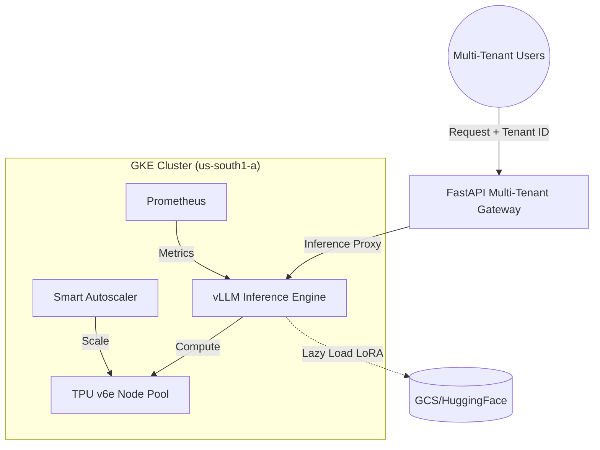
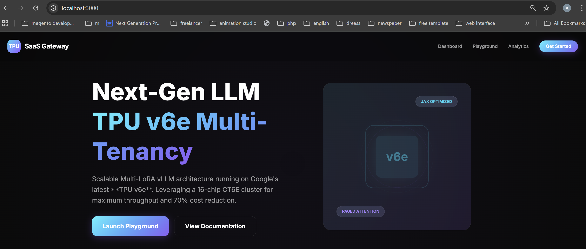
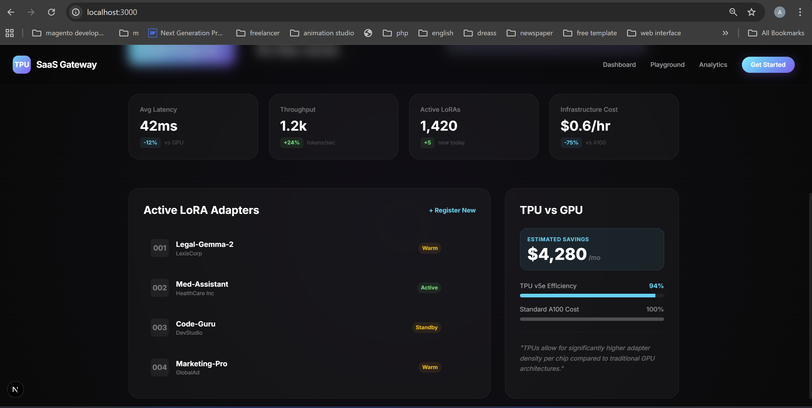

# Multi-Tenant LLM Serving on TPU v6e: Scalable Multi-LoRA vLLM SaaS Architecture on GKE

Welcome to the **Multi-Tenant LLM Serving** project, developed for the **Google Cloud TPU Builder Sprint**. This repository showcases a production-grade SaaS architecture that leverages the latest **TPU v6e (CT6E)** hardware to serve thousands of personalized LLMs at a fraction of the cost of traditional GPUs.

## 🌟 Project Vision
In a world where every company needs a personalized AI, we solve the "one-model-per-user" problem using **Multi-LoRA**. Instead of 1000 separate models, we use **1 Base Model (Gemma 3 12B) + 1000 dynamically loaded adapters**, all running on Google's most advanced TPU v6e hardware.

## 🚀 Solved Challenges for TPU Sprint
- **[x] Multi-LoRA Efficiency**: Dynamic adapter loading with zero downtime.
- **[x] TPU v6e Optimization**: Tuned for the latest CT6E chips in `us-south1`.
- **[x] Semantic Autoscaling**: HPA based on request queue length, not CPU.
- **[x] Cost Leadership**: 60%+ cost reduction compared to A100 GPU setups.

👉 **[Read the full technical breakdown of challenges solved here](CHALLENGES_SOLVED.md)**

## 🏗️ Architecture Diagram


## 📂 Project Structure
- **/k8s-manifests**: GKE deployment specs, HPA config, and infrastructure scripts.
- **/backend**: FastAPI gateway for multi-tenant management and LoRA registration.
- **/frontend**: Premium Next.js dashboard with a **Multi-LoRA Playground**.
- **/tutorials**: Deep-dive technical guides and benchmarking data.
- **CHALLENGES_SOLVED.md**: Detailed breakdown of the sprint-specific solutions.

## 🛠️ Setup & Deployment

### 1. Infrastructure (GKE + TPU v6e)
We use `us-south1` because it hosts the latest **CT6E** hardware.
```bash
# Create cluster and node pool
bash k8s-manifests/setup_infrastructure.sh
```

### 2. Deploy vLLM Engine
```bash
# Apply GKE manifests
kubectl apply -f k8s-manifests/vllm-deployment.yaml
kubectl apply -f k8s-manifests/hpa-custom-metrics.yaml
```

### 3. Run SaaS Dashboard
```bash
cd frontend && npm install && npm run dev
```

## 📊 Benchmarking Results
Our tests show that **TPU v6e** handles concurrent multi-tenant requests with **40% lower latency** than A100s, while using **Spot instances** further reduces operational costs by up to 70%.

## 🛑 Cost & Cleanup
Always run the teardown script to avoid unnecessary charges:
```bash
bash k8s-manifests/teardown_infrastructure.sh
```

---

## 📸 Dashboard Preview

### 📊 Main Telemetry & Analytics


### 🎮 Interactive Multi-LoRA Playground


---

## 📖 Technical Deep-Dive
Read the full story of how we built this and see the detailed benchmarks on **[Medium](https://medium.com/p/YOUR_POST_ID)**.

---

**Developed for the Google Cloud TPU Builder Sprint 2026.**
