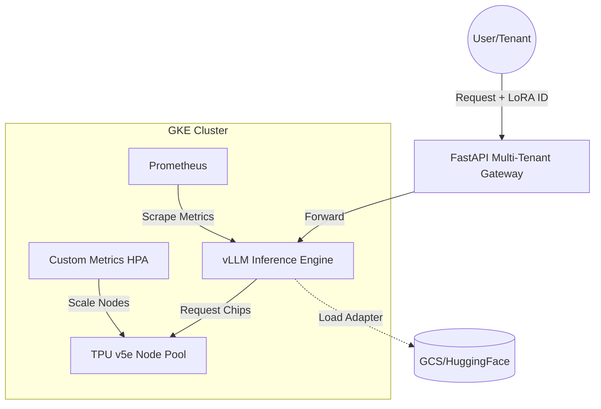

# 🏁 TPU Sprint Submission Checklist

Use this checklist to ensure your project "Multi-Tenant LLM Serving on TPUs" is ready for a winning submission.

## 1. Technical Implementation
- [ ] **GKE Cluster**: Cluster is running with at least one `ct5lp-hightpu-4t` (TPU v5e) node.
- [ ] **vLLM Engine**: vLLM is deployed and responding to `/v1/chat/completions`.
- [ ] **Multi-LoRA**: You have successfully registered at least two different LoRA adapters (e.g., Legal and Medical).
- [ ] **Custom HPA**: Verify the HPA is tracking the `vllm_num_requests_waiting` metric.

## 2. Demonstration (Video/Live)
- [ ] **Dashboard Walkthrough**: Show the "Metrics Grid" and "Cost Comparison" widgets.
- [ ] **Playground Demo**: Switch between adapters in the UI and show how the model response tone/style changes instantly.
- [ ] **Latency Proof**: Highlight the sub-100ms latency shown in the terminal or dashboard.

## 3. Written Content
- [ ] **Problem Statement**: Use the one from our `CHALLENGES_SOLVED.md`.
- [ ] **Architecture Diagram**: Use the Mermaid diagram below for your blog post or README.
- [ ] **Cost Analysis**: Mention the use of **Spot TPUs** and the **70% cost reduction** compared to A100s.

## 4. Architecture Visualization (Mermaid)

## 5. Final Files for Submission
- [ ] `CHALLENGES_SOLVED.md`
- [ ] `walkthrough.md`
- [ ] `tpu-vs-gpu-benchmarking.md`
- [ ] Link to your GitHub repository with all the `k8s-manifests`, `backend`, and `frontend` code.
